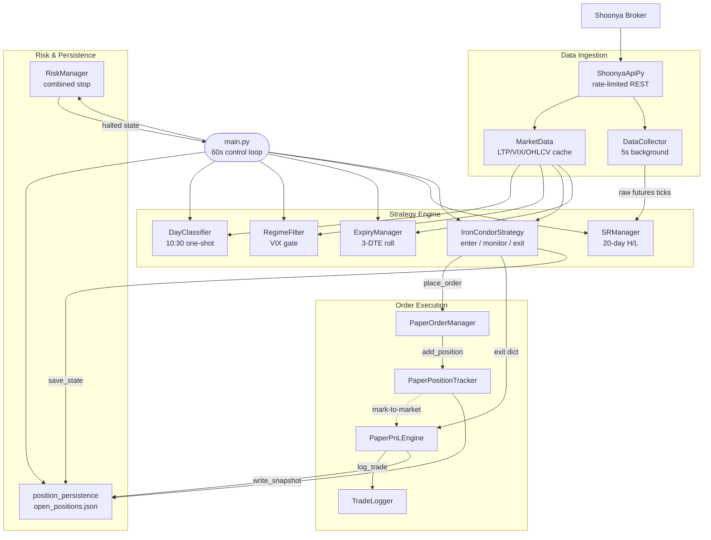

# System Architecture

Grounded in `docs/axioms.md`. Describes the three principal layers — data ingestion, strategy engine, order execution — plus orchestration and risk, and how they interact through the 60-second control loop in `main.py`. See `TECHNICAL_REFERENCE.md` for exhaustive module detail.

## Axiom anchors

- **Axiom 4** (atomic multi-leg) and **Axiom 5** (single accounting path) govern the order-execution boundary.
- **Axiom 3** (safety overrides) governs how data-ingestion failures, quote invalidity, and risk-state uncertainty propagate back to the orchestrator.
- **Axiom 2** (maintain exposure) is the main loop's guiding objective; **Axiom 1** (IC only) scopes what "exposure" means.

## Layers

### Data ingestion

Responsibility: acquire, validate, and cache market data for consumers upstream.

- `api_helper.py` — `ShoonyaApiPy` wraps Shoonya/Noren REST. Adds quote-rate limiting (10/sec hard cap, 170/min global; 4/sec, 120/min low-priority lane for the collector). OAuth token cache + `jKey` fallback on auth failures.
- `data_collector.py` — background thread polling quotes every 5 seconds during market hours, snapshotting to `market_data_YYYYMMDD/raw_data/`. DNS-error backoff of 5 s keeps the thread alive.
- `trading_system/existing/market_data.py` — synchronous quote adapter. LTP cache (2 s TTL), option-price sanity band `[0.05, 5000]`, OHLCV bars (15-min; API preferred, local accumulation fallback).
- `symbol_manager.py` — loads NFO/NSE/BSE symbol masters for token resolution.

### Strategy engine

Responsibility: classify regime, gate entries, select strikes, monitor, and decide exits.

- `day_classifier.py` — one-shot classification at 10:30 (RANGING / TRENDING_UP / TRENDING_DOWN). Locked until `reset()`.
- `regime_filter.py` — continuous VIX gate (< 30, 45-min stability within 1.5-point band). Binary gate on `day_type`.
- `expiry_manager.py` — 3-DTE rolling rule; returns `DD-MMM-YYYY` expiry for new IC entries.
- `sr_manager.py` — 20-day high/low from collected futures raw data, with 50-point buffer applied to short strikes.
- `signal_engine.py` — VWAP (other indicators present but not used — see BUG-16).
- `iron_condor.py` — `IronCondorStrategy`. Strike selection (VIX-tiered OTM + S/R buffer), 4-leg atomic entry, monitoring (1% harvest, breach-triggered exit), force-exit.

### Order execution

Responsibility: place orders, track positions, record realised P&L.

- `paper_order_manager.py` — simulated fills with slippage (baseline + 3× for cheap OTM), STT, flat brokerage. Option-LTP sanity gate. `track_position` flag controls whether fills hit the tracker.
- `paper_position_tracker.py` — per-leg state keyed by option symbol. Weighted-avg price on same-side scaling.
- `paper_pnl_engine.py` — realised (on `record_trade`) + unrealised (via tracker mark-to-market). Writes `paper_summary.json` and `pnl_snapshot.json`.
- `trade_logger.py` — appends completed-trade rows to `paper_trades.csv` (called from `pnl_engine.record_trade`).

### Orchestration and risk

- `main.py` — 60-second control loop; wires the ingestion, strategy, and execution layers plus persistence and risk. Single entry point.
- `risk_manager.py` — combined 3× max-profit stop, 2-tick confirmation, invalid-quote defense, recovery-mode gate (unwired — see BUG-15).
- `position_persistence.py` — per-loop snapshot of strategy + tracker + P&L + risk state to `data/open_positions.json`.

## Data flow

## Control flow — the 60-second cycle

Each tick of `main.py`'s loop (`SIGNAL_RECHECK_SEC = 60`):

1. **Market-hours check** — start collector if market just opened; exit if market closed.
2. **EOD branch** (if `now ≥ TRADE_END = 15:10`) — flatten if next day is non-trading (Axiom 2 weekend/holiday clause); else carry overnight.
3. **Classification** — if past 10:30 and not yet classified, compute VWAP + open/current and classify (one-shot).
4. **Monitor** — for each active IC, call `monitor()`; if exit dict returned, record via `pnl_engine.record_trade`.
5. **Combined hard stop** — `RiskManager.check_combined_stop_loss`; force-exit on breach (Axiom 3).
6. **Entry attempt** — for each inactive strategy, if gate open and not halted: fetch spot/VIX/expiry/S-R, call `enter()`.
7. **Snapshot + persist** — write `pnl_snapshot.json`, save to `open_positions.json`.
8. **Sleep 60 s.**

## Axiom-relevant boundaries

| Boundary | Axiom | Risk if violated |
|---|---|---|
| Ingestion → Strategy | Axiom 3 | Bad quotes propagate into entry/exit decisions. Invalid-LTP defences at `market_data.py` and `paper_order_manager.py` partially close this. |
| Strategy → Execution | Axiom 4 | Partial fills not atomically rolled back create stuck exposure. Enforced in `iron_condor.enter()` except the rollback-failure escalation (BUG-05). |
| Execution → P&L / Tracker | Axiom 5 | Alternate write paths corrupt accounting. Violated by BUG-02 (force_exit discarded), BUG-03 (exit uses `track_position=False`), BUG-04 (rollback same). |
| Orchestrator → Persistence | Axiom 2, 5 | Crash recovery depends on persisted state matching reality. BUG-03 makes `open_positions.json::tracker_positions` unreliable. |

## Known architectural gaps

These affect how layers interact today; tracked individually in `bugs_for_review.md`:

- **BUG-02, BUG-03, BUG-04** — execution boundary bypasses P&L / tracker interfaces. Axiom 5 violations.
- **BUG-05** — rollback failure at execution boundary does not propagate to orchestrator as a halt. Axiom 3 + 4 violation.
- **BUG-07** — no mid-session auth recovery path from ingestion back to orchestrator. Axiom 3 fragility.
- **BUG-18** — expiry-day close not enforced at the orchestrator's EOD gate. Axiom 2 carry-rule violation.
